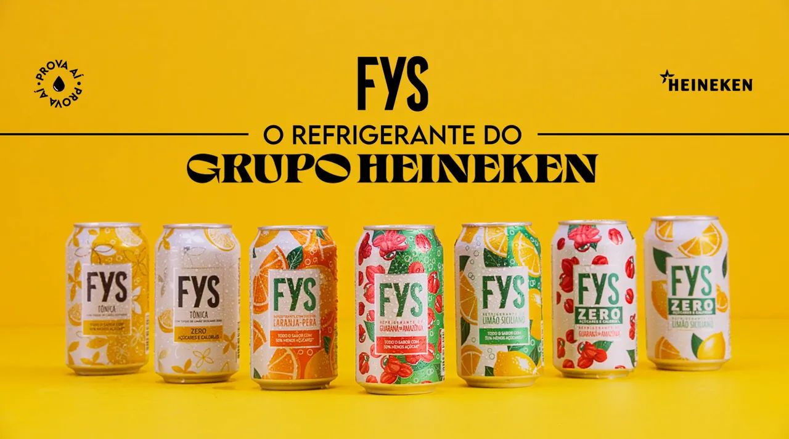
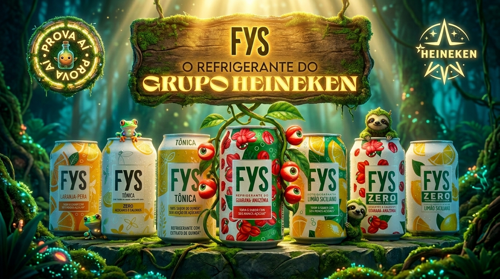

# 🚀 ComFYS – Copiloto Comercial Inteligente

> Assistente comercial baseado em Inteligência Artificial para apoio à tomada de decisão de pequenos e médios varejistas parceiros da FYS.

<table align="center">
        <tbody>
                <tr>
                        <td align="center" width="50%">
                                <figure>
                                        
                                        <figcaption><strong>Versão base do projeto</strong></figcaption>
                                </figure>
                        </td>
                        <td align="center" width="50%">
                                <figure>
                                        
                                        <figcaption><strong>Versão com conceito sustentável</strong></figcaption>
                                </figure>
                        </td>
                </tr>
        </tbody>
</table>

---

## 📖 Sobre o Projeto

O **ComFYS** é um projeto desenvolvido como solução conceitual para apoiar equipes comerciais e estabelecimentos parceiros na identificação de oportunidades de venda, tratamento de objeções comerciais e recomendação de ações durante períodos sazonais e eventos regionais.

A proposta é demonstrar como uma base estruturada de conhecimento, associada a regras de decisão e IA generativa, pode transformar informações comerciais em orientações práticas para o ponto de venda.

---

## 🎯 Problema

Pequenos e médios estabelecimentos frequentemente enfrentam dúvidas relacionadas a:

- Planejamento de estoque
- Mix de produtos
- Eventos regionais
- Ruptura de abastecimento
- Giro de mercadorias
- Espaço físico reduzido
- Concorrência
- Sazonalidade

Ao mesmo tempo, as equipes comerciais nem sempre conseguem atender todos os parceiros no momento em que a decisão precisa ser tomada.

---

## 💡 Solução

O ComFYS atua como um **copiloto comercial inteligente**, capaz de:

- Identificar objeções comerciais
- Reconhecer eventos regionais relevantes
- Recomendar campanhas adequadas ao contexto
- Responder perguntas frequentes
- Apoiar a tomada de decisão do lojista
- Fornecer orientações contextualizadas

---

## 🏗️ Arquitetura Conceitual

```text
Usuário
   │
   ▼
Assistente IA
   │
   ├── faq.json
   ├── objecoes.json
   ├── campanhas.json
   ├── eventos_regionais.json
   └── regras_decisao.json
   │
   ▼
Resposta Contextualizada
```

---

## 🧠 Base de Conhecimento

A camada de conhecimento é composta por arquivos JSON estruturados.

### faq.json

Contém perguntas frequentes relacionadas a:

- Pedidos
- Entregas
- Trocas
- Armazenamento
- Comodato
- Geladeira expositora de bebidas (visicoolers)
- Suporte comercial

---

### objecoes.json

Mapeia objeções comerciais e respectivas contra-objeções.

Exemplos:

- Falta de espaço físico
- Baixo giro de estoque
- Concorrência
- Custo de energia
- Sazonalidade
- Mix de produtos

Também contempla objeções relacionadas a eventos regionais.

---

### campanhas.json

Contém campanhas comerciais utilizadas para apoiar a resolução de objeções.

Exemplos:

- Operação Esquadrão Ambulante
- Combo Turbo Gelo e Trincando
- Estoque Programado e Risco Zero
- Parceiro Premium
- Giro Certo

---

### eventos_regionais.json

Mapeia eventos de impacto comercial em diversas regiões do Brasil.

Exemplos:

- Carnaval
- Círio de Nazaré
- São João
- Oktoberfest
- Semana Farroupilha
- Festival Bananada

---

### regras_decisao.json

### 🌳 Arquitetura da Árvore de Decisão

O mecanismo de recomendação do ComFYS utiliza uma árvore de decisão baseada em contexto, composta por quatro etapas sequenciais de filtragem.

```text
[Input do Usuário]
        │
        ▼
┌─────────────────────────────┐
│ 1. Identificação Geográfica │
└─────────────────────────────┘
Captura a cidade ou região do ponto de venda.

        │
        ▼
┌─────────────────────────────┐
│ 2. Identificação Temporal   │
└─────────────────────────────┘
Verifica a existência de eventos regionais ativos.

        │
        ├──► Sem evento:
        │      Fluxo comercial padrão
        │
        └──► Com evento:
               Ativa o modo sazonal

        │
        ▼
┌─────────────────────────────┐
│ 3. Classificação da Intenção│
└─────────────────────────────┘
Identifica a objeção ou necessidade apresentada pelo lojista.

        │
        ▼
┌─────────────────────────────┐
│ 4. Cruzamento de Regras     │
└─────────────────────────────┘
Combina:

• Evento Regional
• Objeção Identificada
• Contra-objeção
• Campanha Recomendada
• FAQ de Apoio

        │
        ▼
[Resposta Contextualizada]
```

Essa abordagem permite gerar recomendações alinhadas ao contexto geográfico, temporal e comercial de cada situação apresentada.

---

## 🧪 Testes Mockados

Para validação do MVP foram criados cenários simulados.

### Cenário 1 – Evento Regional

**Local:** Belém (PA)

**Evento:** Círio de Nazaré

**Objeção:** Refrigeração e alta demanda

**Campanha sugerida:** Combo Turbo Gelo e Trincando

---

### Cenário 2 – Operação Regular

**Local:** Campinas (SP)

**Evento:** Nenhum

**Objeção:** Mix de produtos

**Campanha sugerida:** Parceiro Premium

---

## 📁 Estrutura do Projeto

```text
## 📁 Estrutura do Projeto

```text
BOOTCAMP_HEINEKEN-FYS/

├── assets/
│   └── to_readme/
│       ├── acessibilidade_isa.png
│       ├── FYS_Florest.jpeg
│       └── FYS_teste.jpeg
│
├── docs/
│   ├── Acessibilidade_e_Inclusao_v1.0.md
│   ├── Arquitetura_da_Informacao_v1.0.md
│   ├── Backlog_de_Evolucao_v1.0.md
│   ├── Casos_de_Uso_v1.0.md
│   ├── Contexto_do_Negocio_v1.0.md
│   ├── Escopo_da_Solucao_v1.0.md
│   ├── Jornada_do_Usuario_v1.1.md
│   ├── Personas_v1.1.md
│   └── Product_Vision_v1.1.md
│
├── examples/
│   ├── teste_com_evento.md
│   └── teste_sem_evento.md
│
├── knowledge/
│   ├── campanhas.json
│   ├── eventos_regionais.json
│   ├── faq.json
│   ├── objecoes.json
│   ├── produtos.json
│   └── regras_decisao.json
│
└── README.md
```


---

##  Acessibilidade e Inclusão

O projeto considera boas práticas de acessibilidade digital:

- HTML semântico
- Navegação por teclado
- Contraste adequado
- Compatibilidade com leitores de tela
- Preparação para validações WCAG

---

## 🔒 Observação Importante

Este projeto foi desenvolvido para fins educacionais, demonstração técnica e composição de portfólio.

As informações comerciais presentes na base de conhecimento representam cenários simulados e hipóteses utilizadas para modelagem do MVP.

Não devem ser interpretadas como políticas comerciais oficiais da FYS.

---

## 🚀 Próximas Evoluções

- Interface React
- Integração com IA Generativa
- Busca semântica
- Dashboard comercial
- Recomendações personalizadas
- Histórico de interações
- Integração com APIs externas

---

## 📄 Licença

> Projeto desenvolvido para o Desafio Final do Bootcamp-HEINEKEN - FYS_IA_Aplicada_em_Vendas.

## 👨‍💻 Autor

**Ricardo Werner**  
Desenvolvedor Front-End com foco em acessibilidade e inclusão digital, UX e IA aplicada a negócios

---
